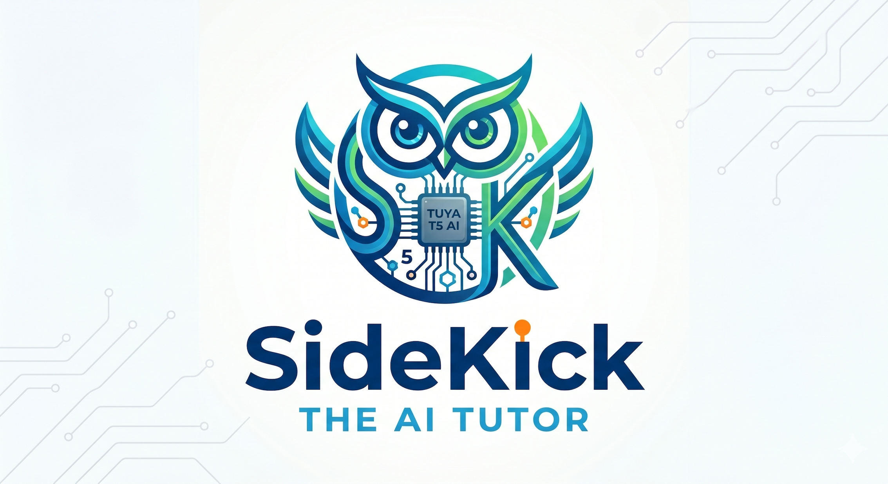
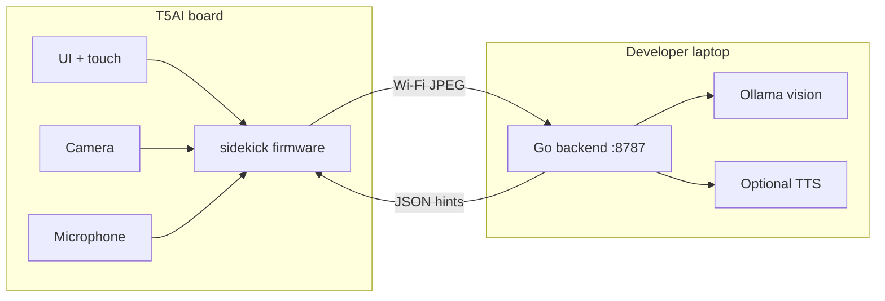

<p align="center">
  
</p>

<p align="center">
  <strong>Sidekick</strong> — camera and voice AI tutor on the Tuya T5AI board
</p>

<p align="center">
  <a href="apps/sidekick/README.md">Firmware guide</a> ·
  <a href="apps/sidekick/backend/README.md">Backend API</a> ·
  <a href="https://tuyaopen.ai/docs/quick-start/enviroment-setup">TuyaOpen setup</a>
</p>

## Overview

Sidekick is a hackathon app built on [TuyaOpen](https://github.com/tuya/TuyaOpen): a T5AI dev board with a 3.5″ LCD, touch, camera, mic, and speaker runs on-device UI and capture; a small Go service on your laptop runs vision tutoring (Ollama) and optional TTS.

| Layer                                  | Role                                                                                    |
| -------------------------------------- | --------------------------------------------------------------------------------------- |
| **Firmware** (`apps/sidekick/`)        | Home screen, tutor modes, mic capture, JPEG upload over Wi‑Fi                           |
| **Backend** (`apps/sidekick/backend/`) | `POST /sidekick/frame` → Ollama vision; session context; optional ElevenLabs/OpenAI TTS |

### Tutor modes

Touch the home screen to cycle modes (default: **Hint**):

- **Active** — full tutoring loop (session state machine)
- **Hint** — short visual hints from camera frames
- **Summary** — wrap-up style responses

Camera preview is wired but off by default so the home screen owns the display.

## Hardware

- **Board:** Tuya T5AI EVB
- **Expansion:** 3.5″ LCD module + camera (`CONFIG_TUYA_T5AI_BOARD_EX_MODULE_35565LCD`, `CONFIG_ENABLE_EX_MODULE_CAMERA`)

## Quick start

### 1. TuyaOpen environment

From the repository root:

```bash
. ./export.sh
```

See [TuyaOpen environment setup](https://tuyaopen.ai/docs/quick-start/enviroment-setup) if tools or submodules are missing.

### 2. Device config (firmware)

The board does not read `.env` at runtime. Network settings are baked in at build time:

```bash
cd apps/sidekick
cp .env.example .env.local
# Edit SIDEKICK_BACKEND_HOST (your Mac LAN IP), SIDEKICK_WIFI_SSID, SIDEKICK_WIFI_PSWD
```

Priority: defaults → `.env.example` → `.env` → `.env.local` → shell `export SIDEKICK_*`.

`SIDEKICK_BACKEND_HOST` must be your laptop’s LAN address (not `localhost`).

### 3. Backend (laptop)

```bash
ollama pull llama3.2-vision:11b
cd apps/sidekick/backend
cp .env.example .env.local   # optional: TTS keys
go run .
```

Listens on `http://0.0.0.0:8787`. For bring-up without Ollama: `SIDEKICK_AI_PROVIDER=fake go run .`

Details: [apps/sidekick/backend/README.md](apps/sidekick/backend/README.md).

### 4. Build and flash

```bash
cd apps/sidekick
uv run python ../../tos.py build
uv run python ../../tos.py flash -p /dev/cu.usbmodemXXXX   # your port from ls /dev/cu.*
```

More firmware notes: [apps/sidekick/README.md](apps/sidekick/README.md).

## Project layout

```text
apps/sidekick/
├── assets/
├── src/                 # main entry
├── hardware/            # board registration
├── ui/                  # LCD home screen and touch
├── vision/              # camera capture / preview
├── audio/               # mic + startup chime
├── backend_client/      # HTTP client to Go service
├── tutor/               # session + mode state machine
├── include/             # app config (generated device_config.h)
├── scripts/             # .env → device_config generator
└── backend/             # Go HTTP service
```

## Architecture



## SDK and license

Firmware uses the TuyaOpen C/C++ SDK in this tree. Upstream docs: [TuyaOpen Developer Guide](https://tuyaopen.ai/docs/about-tuyaopen).

Distributed under the Apache License 2.0 — see [LICENSE](LICENSE).
