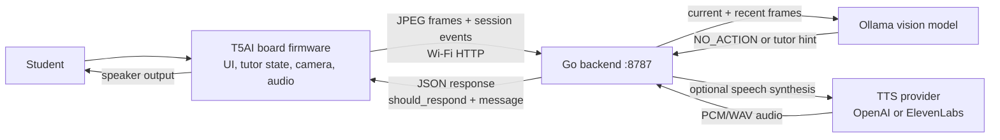
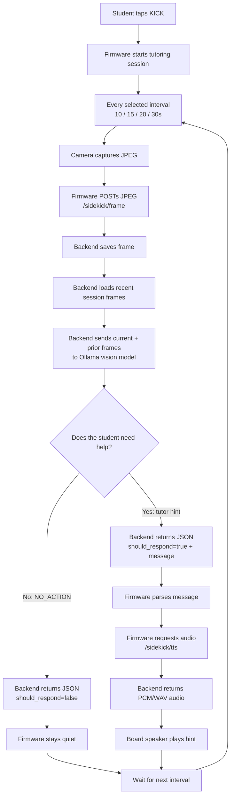

# Sidekick Architecture

Sidekick is an AI tutor firmware app for Tuya T5AI hardware with camera,
microphones, display, and optional speaker output.

## Project Layout

```text
apps/sidekick/
  app_default.config       T5AI board configuration for the app
  CMakeLists.txt           TuyaOpen app build registration
  src/                     Firmware entry point
  hardware/                Board hardware registration
  vision/                  Camera and display preview pipeline
  audio/                   Microphone capture pipeline
  ui/                      Touch input and mode switching
  tutor/                   Tutor session state and orchestration
```

## Component Interaction Graph



Build-time config still comes from `.env.local` and generated headers. Backend
routes, provider options, and defaults are listed below in Fact-Checked Defaults.
The image-processing loop is expanded in the Sequential Workflow.

## Sequential Workflow



`NO_ACTION` means the backend decided the student does not need an
interruption, so the firmware does not play anything. A tutor message means the
firmware asks `/sidekick/tts` for playable audio, then sends the returned PCM/WAV
data to the speaker. This loop repeats until the student ends the session.

Speech-to-text is not implemented in the current backend routes. The backend
currently exposes health, frame upload, session summary, and text-to-speech
endpoints only.

## Fact-Checked Defaults

| Item | Current value |
| --- | --- |
| Ollama model | `llama3.2-vision:11b` |
| Backend routes | `GET /health`, `POST /sidekick/frame`, `POST /sidekick/session/end`, `POST /sidekick/tts` |
| Sliding context default | `SIDEKICK_CONTEXT_FRAMES=1` |
| TTS provider default | `SIDEKICK_TTS_PROVIDER=none` |
| TTS options | `openai`, `elevenlabs` |
| Firmware TTS request format | `pcm_16000` |
| Capture interval options | `10`, `15`, `20`, `30` seconds |
| STT / speech-to-text | Not implemented |

## Reproduction Commands And Runtime Values

```bash
# Laptop LAN IP for SIDEKICK_BACKEND_HOST.
ipconfig getifaddr en0

# Backend service.
ollama pull llama3.2-vision:11b
cd apps/sidekick/backend
go run .

# Firmware network config and build.
cd apps/sidekick
cp .env.example .env.local
# edit SIDEKICK_BACKEND_HOST, SIDEKICK_WIFI_SSID, SIDEKICK_WIFI_PSWD
uv run python ../../tos.py build

# Device port and flash.
ls /dev/cu.*
uv run python ../../tos.py flash -p /dev/cu.usbmodemXXXX
```

## Current Boot Flow

1. Initialize Tuya logging.
2. Register board hardware.
3. Initialize KV, software timers, and the work queue.
4. Initialize the tutor session in Hint mode with the default capture interval.
5. Start the LCD/touch UI.
6. Open microphone input and count captured PCM frames.
7. Play the startup chime when enabled.
8. Start the backend worker thread; Wi-Fi/network setup is deferred until the
   first upload.
9. Start camera preview only when enabled; otherwise the home screen owns the
   display.
10. Poll touch input and tick the tutor session state machine.

## Build

From the repository root:

```bash
cd apps/sidekick
uv run python ../../tos.py build
```

## Flash

Use the serial port shown by `ls /dev/cu.*`.

```bash
uv run python ../../tos.py flash -p /dev/cu.usbmodemXXXX
```

## Near-Term Milestones

- Validate camera preview inside `apps/sidekick`.
- Validate microphone frame capture without relying on speaker playback.
- Add a push-to-talk or wake-word interaction state.
- Add network setup and AI service boundary.
- Add speaker response once the external speaker module is available.
