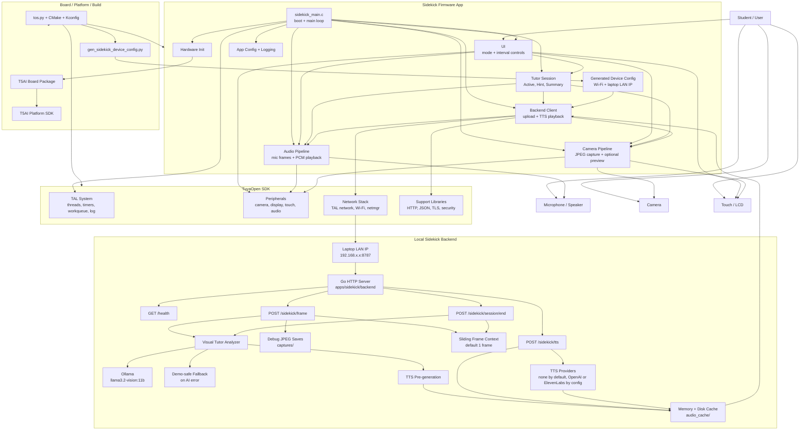

# Sidekick Architecture

Sidekick is an AI tutor firmware app for Tuya T5AI hardware with camera,
microphones, display, and optional speaker output.

## Project Layout

```text
apps/sidekick/
  app_default.config       T5AI board configuration for the app
  CMakeLists.txt           TuyaOpen app build registration
  src/                     Firmware entry point
  hardware/                Board hardware registration
  vision/                  Camera and display preview pipeline
  audio/                   Microphone capture pipeline
  ui/                      Touch input and mode switching
  tutor/                   Tutor session state and orchestration
```

## Component Graph



Speech-to-text is not implemented in the current backend routes. The backend
currently exposes health, frame upload, session summary, and text-to-speech
endpoints only.

## Current Boot Flow

1. Initialize Tuya logging.
2. Register board hardware.
3. Start camera preview on the LCD.
4. Start microphone capture.
5. Start in Hint Coach mode.
6. Poll touch input so a tap cycles modes: `Active -> Hint -> Summary`.
7. Run the tutor session state machine.

Speaker output is intentionally not part of the first scaffold because the
external speaker module still needs hardware validation.

## Build

From the repository root:

```bash
cd apps/sidekick
uv run python ../../tos.py build
```

## Flash

Use the serial port shown by `ls /dev/cu.*`.

```bash
uv run python ../../tos.py flash -p /dev/cu.usbmodemXXXX
```

## Near-Term Milestones

- Validate camera preview inside `apps/sidekick`.
- Validate microphone frame capture without relying on speaker playback.
- Add a push-to-talk or wake-word interaction state.
- Add network setup and AI service boundary.
- Add speaker response once the external speaker module is available.
